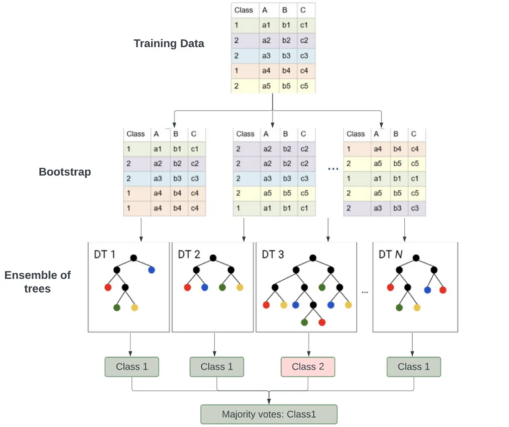
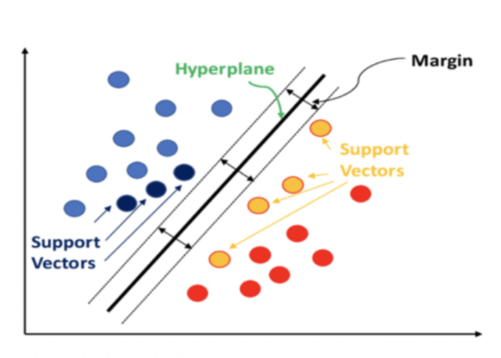
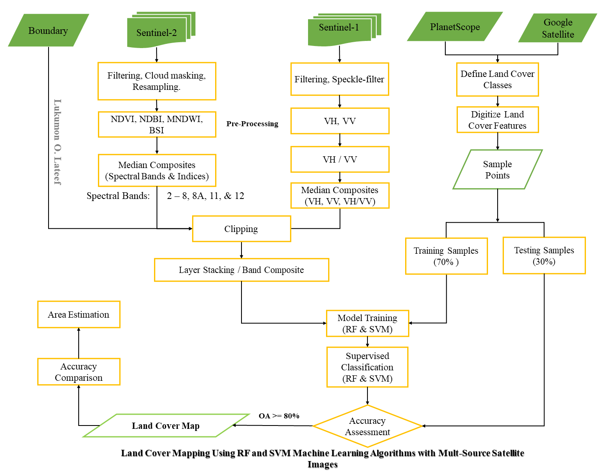

# Introduction
Land cover (LC) is the Earth’s surface features; water, soil, vegetation and other related classes. Land cover (LC) is the surface features while land use is the purpose that the land serves, which can be residential, recreation, or agriculture (Minal and Patil, 2017). Accurate and up-to-date LC information is important for decision-making processes and planning at various scales/levels. The increasing pressure on land because of population changes also calls for regular information on LC to capture the changes in the ecosystem. However, conventional methods are time-consuming and not efficient for large-scale land cover mapping. Thankfully, with the advancement in technology, there are now machine learning algorithms, huge volumes of remotely sensed data with improved spatio-temporal resolution, and cloud computing platforms like the Google Earth Engine, which have revolutionized land cover mapping over the years. This project assessed the performance of Random Forest (RF) and Support Vector Machines (SVM) machine learning algorithms for land cover classification in a predominant agricultural landscape using the fusion of time-series Sentinel-1 and Sentinel-2 in Google Earth Engine (GEE) Python API.

# Objectives
   * Identify land cover classes from PlanetScope (3m spatial resolution) and Google Satellite imageries.
   * Classify land cover types using Sentinel-1 and Sentinel-2 imagery (10m spatial resolution).
   * Evaluate models' (RF and SVM) performance with accuracy metrics.
   * Determine the most important features for land cover classification.
   * Compare land cover results with original Sentinel-2 imagery.

# Study Area
This study area is Hadejia Local Government Area (LGA) in Jigawa state, North-west Nigeria. The area is mainly agricultural, dominated by cropland.

# Methodology

## Machine Learning Algorithms
Random Forests (RF) and Support Vector Machine (SVM) were selected for this project because of their better performance in land cover classifications as proved in the literature (Abdi, 2019; Khatami et al., 2016; Maxwell et al., 2018; Shih et al., 2018)

### Random Forests (RF)
The Random Forest (RF) algorithm is an ensemble classifier and an advanced version of a Decision Tree (DT) comprising a collection of tree-structured classifiers. A tree is grown using the training set and the most popular class is chosen for each unknown (Breiman, 2001). RF algorithm selects a random subset of variables or predictors at each split (Liaw, 2002). RF algorithm requires two hyperparameters before it starts to separate data, the number of trees to make an ensemble and the number of features at each split. It is also a non-parametric classifier - a statistical assumption on data distribution. RF has a low computational requirement, can estimate the importance of variables, and overcomes the shortcomings of the over-fitting present in DT because it always converges (Pal, 2005; Rodriguez-Galiano, 2012). 

### Support Vector Machine (SVM)
Support Vector Machines (SVM) focuses on the training samples closest to the optimal boundary between classes, known as support vectors (). SVM aims to maximize the margin between these support vectors. Although SVM is a binary classifier, it can handle multiple classes by applying the classifier to each class combination, increasing processing time as the number of classes grows (). The parameters of SVM include Cost or slack parameter (C),  Kernel type, and Kernel-dependent parameters - Polynomial: (polynomial order (p)) and Radial basis: (gamma (γ)) (Cortes and Vapnik, 1995; Maxwell et al., 2018).

## Workflow

# Results

https://github.com/Surv-Lukmon/Land-Cover-Classification-Using-Machine-Learning-Algorithms-and-Multi-Source-Satellite-Images/assets/81117834/3d8b6c33-6d02-4211-a974-ef3a08e1c667

## Land Cover Maps

## Accuracy Assessment

# References / Resources

Abdi, A. M. (2019). Land cover and land use classification performance of machine learning algorithms in a boreal landscape using Sentinel-2 data. GIScience & Remote Sensing, 57(1), 1–20. https://doi.org/10.1080/15481603.2019.1650447

Cortes, C., Vapnik, V. Support-vector networks. Mach Learn 20, 273–297 (1995). https://doi.org/10.1007/BF00994018

Datatron (n.d). What is a Support Vector Machine?. https://datatron.com/what-is-a-support-vector-machine/

Different methods for masking clouds of Sentinel-2 images in GEE: https://gis.stackexchange.com/questions/445556/different-methods-for-masking-clouds-of-sentinel-2-images-in-gee Accesse: 29 May 2024.

Geemap. 103 split control: Creating a split-panel map. https://geemap.org/notebooks/103_split_control/

Google Earth Engine. ee.Classifier.smileRandomForest. https://developers.google.com/earth-engine/apidocs/ee-classifier-smilerandomforest

Google Earth Engine. ee.Classifier.libsvm. https://developers.google.com/earth-engine/apidocs/ee-classifier-libsvm

Hemashreekilari (Aug 11, 2023). Understanding Random Forest. https://medium.com/@hemashreekilari9/understanding-random-forest-a87d08416280. Accesse: 29 May 2024.

Liaw, A., and Wiener, M. (2002). Classification and Regression by Random Forest. R news 2. 18-22. https://journal.r-project.org/articles/RN-2002-022/RN-2002-022.pdf

Maxwell, A.E., Warner, T.A., & Fang, F., (2018). Implementation of machine-learning classification in remote sensing: an applied review. Int. J. Remote Sens. 39, 2784–2817. https://doi.org/10.1080/01431161.2018.1433343

Minal S. A. and Patil K.A. (2017). Land Use/ Land Cover Change Detection Using Remote Sensing and GIS in Aurangabad and Jalna districts, India. International Journal of Current Engineering and Scientific Research (IJCESR), 4(6), 46-52

Pal, M. (2005). Random Forest Classifier for Remote Sensing Classification. International Journal of Remote Sensing 26 (1), 217–222. doi:10.1080/01431160412331269698.

Sentinel Hub .Sentinel-2. https://custom-scripts.sentinel-hub.com/custom-scripts/sentinel/sentinel-2/. Accesse: 29 May 2024.

Shih H.-C., Stow, D.A, & Tsai, Y.H. (2018). Guidance on and comparison of machine learning classifiers for Landsat-based land cover and land use mapping. International Journal of Remote Sensing. DOI: https://doi.org/10.1080/01431161.2018.1524179

Singh, S.K., Srivastava, P.K., Gupta, M., Thakur, J.K., & Mukherjee, S. (2014). Appraisal of land use/land cover of mangrove forest ecosystem using support vector machine. Environ Earth Sci 71, 2245–2255 (2014). https://doi.org/10.1007/s12665-013-2628-0
